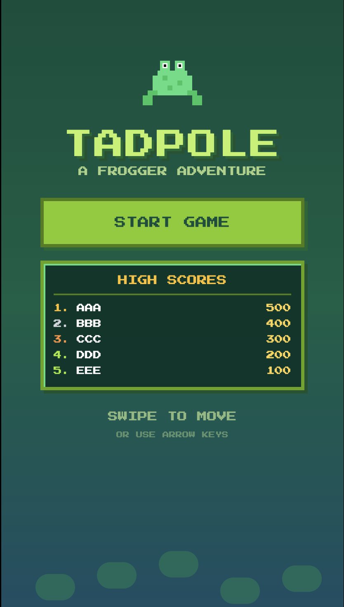
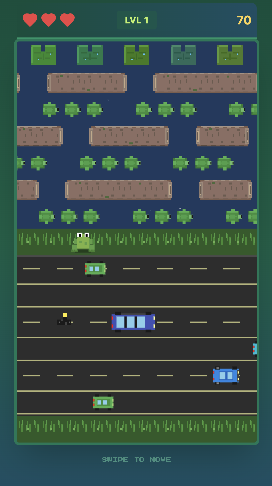

# 🐸 Tadpole Dash

**Hop your way to victory in this ribbiting Frogger-style adventure!**



Get ready to guide your fearless tadpole across busy roads and treacherous rivers in this modern twist on the classic arcade game. Dodge speedy cars, leap onto logs and turtles, and fill all the lily pad homes to advance to the next level!



## 🎮 How to Play

### Controls
- **Desktop/Laptop**: Use **Arrow Keys** (↑ ↓ ← →) to hop around
- **iPhone/Mobile**: **Swipe** in any direction to move your tadpole

### Objective
Navigate your tadpole safely across:
- 🚗 **Roads** - Dodge cars, trucks, and motorcycles
- 🌊 **Rivers** - Jump on logs and turtles (but watch out for diving turtles!)
- 🏠 **Lily Pads** - Fill all 5 homes to complete the level

### Power-Ups
- ❤️ **Extra Life** - Grab a bonus life to keep hopping
- ✨ **Invincibility** - Temporary protection from hazards

### Tips
- Time your movements carefully - patience is key!
- Watch out for turtles that dive underwater
- Each level gets faster and trickier
- You get 3 continues to keep your high score going

## 🚀 Quick Start

### Requirements
- Node.js and npm (nvm recommended)

### Installation

```sh
# Clone the repository
git clone https://github.com/CarlosFranzetti/tadpole-dash.git
cd tadpole-dash

# Install dependencies
npm install

# Start the development server
npm run dev

# Build for production
npm run build
npm run preview

# Lint your code
npm run lint
```

## 🛠️ Technologies Used

- **Vite** - Lightning-fast build tool
- **TypeScript** - Type-safe development
- **React** - UI framework
- **shadcn-ui** - Beautiful component library
- **Tailwind CSS** - Utility-first styling
- **Framer Motion** - Smooth animations

## 🎨 Development

### Project Structure
- `src/pages` - Game pages and screens
- `src/components/game` - Game components (TitleScreen, GameCanvas, GameHUD, etc.)
- `src/hooks/useGameLogic.ts` - Core game logic
- `src/lib/gameTypes.ts` - TypeScript interfaces
- `src/lib/gameConstants.ts` - Game configuration

### Adding Routes
Routes are lazy-loaded in `src/App.tsx` using Suspense. Add new routes there and keep the catch-all `*` route at the bottom.

## 🏆 High Scores

Beat your friends! High scores are saved locally, so keep hopping and climbing that leaderboard!

## 📸 Sharing

Love the game? Share it with friends! When posting on social media:
- Use the title screen screenshot (`titlecard.png`) as your preview image
- Replace `public/og-image.png` with the title screen for automatic link previews
- Tag it with #TadpoleDash 🐸

## 🤝 Contributing

Found a bug? Want to add a feature? Contributions are welcome! Feel free to:
1. Fork the repository
2. Create a feature branch
3. Make your changes
4. Submit a pull request

For major changes, please open an issue first to discuss what you'd like to change.

## 📝 License

This project is open source and available for educational and personal use.

---

**Happy Hopping! 🐸💚**

Made with ❤️ and lots of retro gaming nostalgia