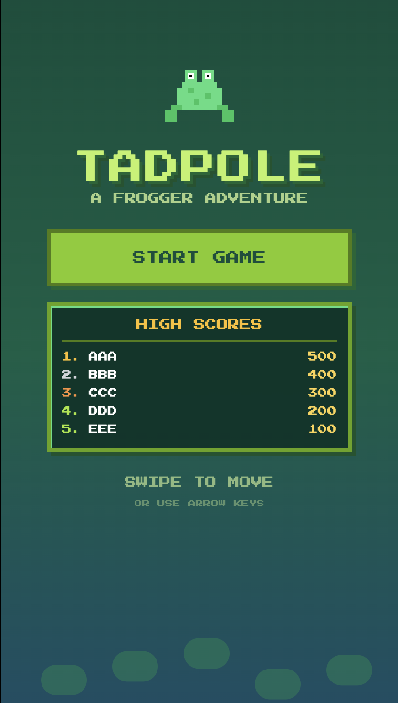

# 🐸 Tadpole Dash 🐸

Welcome to **Tadpole Dash**, a high-octane, vibecoded tribute to the legendary 8-bit arcade classic *Frogger*! This isn't just a clone; it's a neon-soaked, pixel-perfect reimagining built for the modern web. 🕹️✨



## 🕹️ Part of "Los Retro Remix Roundups"
Tadpole Dash is a proud member of **Los Retro Remix Roundups**—a curated collection of vibecoded, 8-bit inspired retro gems. 

Our ultimate vision? A fully interactive, 8-bit retro arcade environment. Soon, you'll be able to:
- 🚶‍♂️ Walk around a virtual arcade.
- 🪙 Scavenge for quarters under the machines.
- 🕹️ Hop onto different cabinets and chase high scores.

### 👾 The Roundup Collection:
- **Tadpole Dash** 🐸 (This very machine!)
- **Paxman** 🍒 (A yellow-chomp *Pacman* tribute)
- **Monkey King** 🦍 (A barrel-dodging *Donkey Kong* remix)
- **Phoenix Arcade** 🦅 (A high-flying space shooter)

---

## 🚀 Game Features
- **8-Bit Procedural Art:** Every sprite and environment is hand-drawn via code for that authentic retro crunch. 🎨
- **Web Audio Synth:** Procedural 8-bit sound effects generated on the fly. No heavy MP3s, just pure oscillators. 🔊
- **Progressive Difficulty:** Dodge faster cars and navigate trickier rivers as you advance through the levels. 🚗🌊
- **Vibecoded CRT Filter:** Scanlines, screen shake, and neon glows to transport you back to the golden age of arcades. 📺
- **Power-Ups:** Grab **Extra Lives** or **Invincibility** to survive the treacherous journey to the lily pads. ⚡

---

## 🎮 How to Play

### **Desktop** ⌨️
- **Arrow Keys:** Hop your tadpole in any direction.
- **Spacebar:** Start the game or continue.

### **Mobile** 📱
- **Swipe:** Gesture in any direction to move.
- **Tap:** Start the game or interact with menus.

---

## 🛠️ Tech Specs
This project is built with a modern stack but a retro soul:
- **React 18** + **TypeScript** ⚛️
- **Custom Canvas Engine** 🖼️
- **Web Audio API** 🎹
- **Tailwind CSS** 🎨
- **Framer Motion** ✨

---

## 🚀 Get Running
Want to load this machine into your own local arcade?

1. **Install Dependencies:**
   ```bash
   npm install
   ```

2. **Start the Engine:**
   ```bash
   npm run dev
   ```

3. **Battle for the High Score:**
   Open `http://localhost:5173` and start hopping!

---

## 📜 Development Conventions
- **Keep it Lean:** No external asset bloat. If it can be drawn with a pixel or synthesized with a wave, do it in code.
- **The Vibe is Priority:** If the screen isn't shaking during a near-miss, it's not vibecoded enough.
- **Component Separation:** Core game logic stays in `useGameLogic.ts`, UI lives in React.

**Los Retro Remix Roundups** — *Bringing the arcade back, one quarter at a time. 🪙👾*
